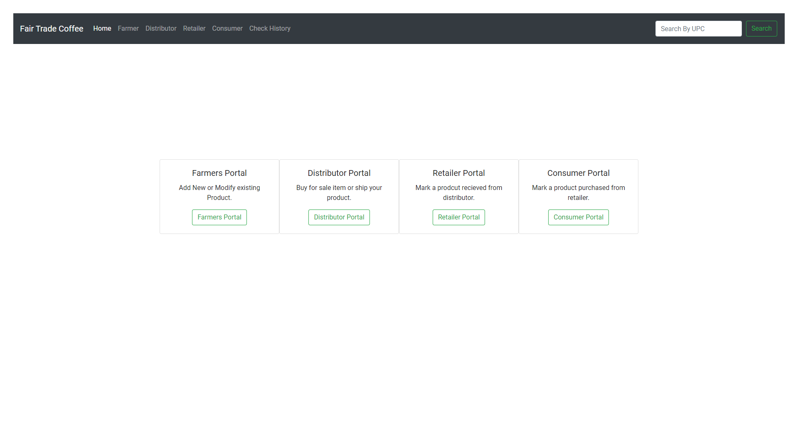
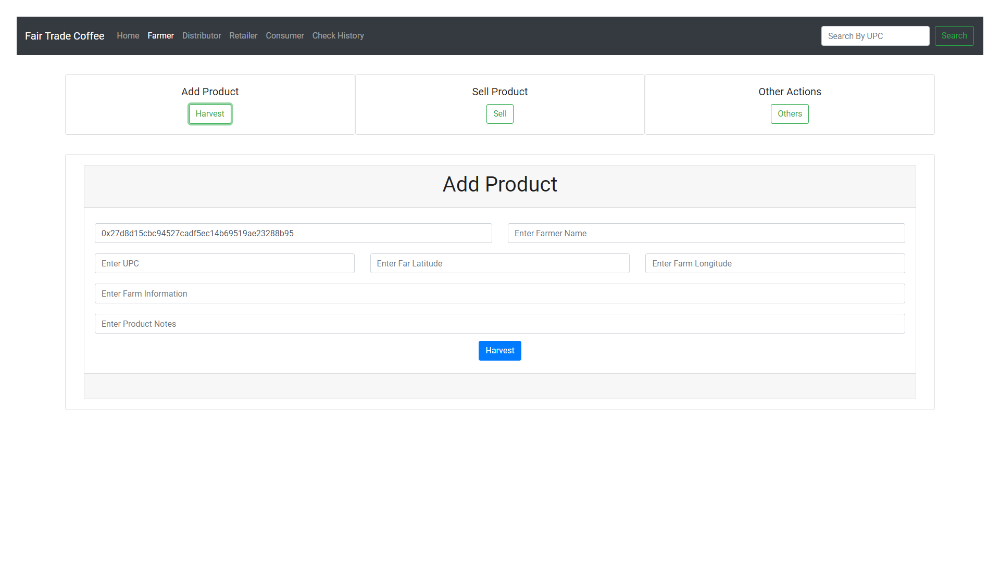
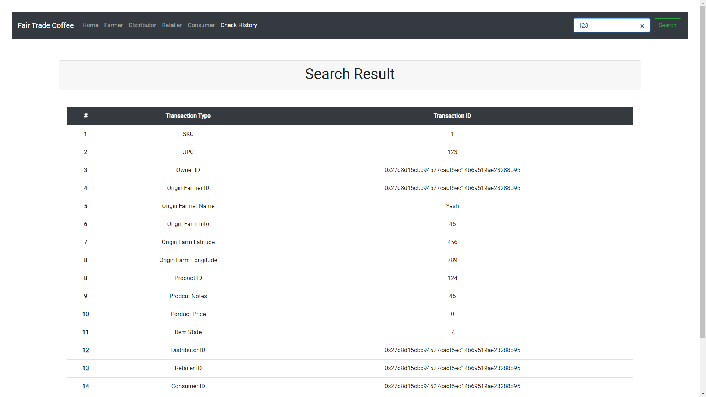
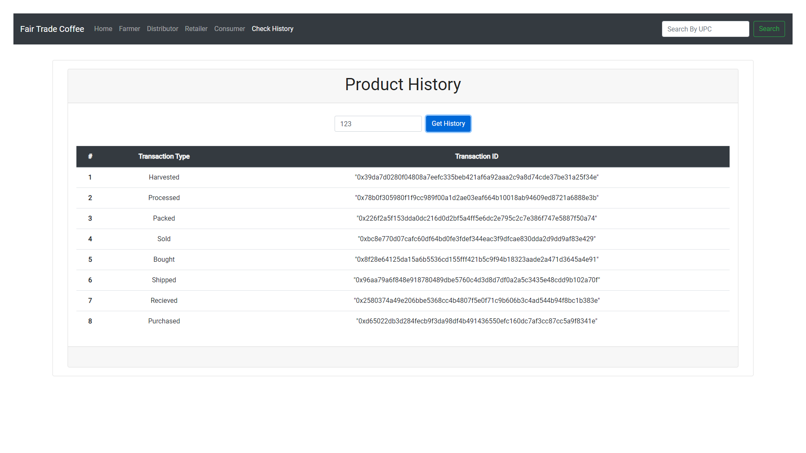
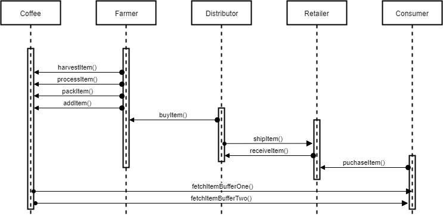

# Supply Chain Smart Contract

This repository containts an Ethereum DApp that demonstrates a Supply Chain flow between a Seller and Buyer. The user story is similar to any commonly used supply chain process. A Seller can add items to the inventory system stored in the blockchain. A Buyer can purchase such items from the inventory system. Additionally a Seller can mark an item as Shipped, and similarly a Buyer can mark an item as Received.

## Getting Started

These instructions will get you a copy of the project up and running on your local machine for development and testing purposes. See deployment for notes on how to deploy the project on a live system.

### Prerequisites

Please make sure you've already installed ganache-cli, Truffle and enabled MetaMask extension in your browser.

### Installing

A step by step series of examples that tell you have to get a development env running

Clone this repository:

```
git clone https://github.com/AlphaArtrem/udacity_blockchain_developer_nanodegree.git
```

Change directory to ```p3_supply_chain``` folder and install all requisite npm packages (as listed in ```package.json```):

```
cd p3_supply_chain
npm install
```

Launch Ganache:

```
ganache-cli -m "spirit supply whale amount human item harsh scare congress discover talent hamster"
```

In a separate terminal window, Compile smart contracts:
This will create the smart contract artifacts in folder ```build\contracts```.

```
truffle compile
```

Migrate smart contracts to the locally running blockchain, ganache-cli:

```
truffle migrate
```

Your terminal should look something like this:

Test smart contracts:
All 11 tests should pass.

```
truffle test
```

In a separate terminal window, launch the DApp:

```
npm run dev
```

## Built With

* [Ethereum](https://www.ethereum.org/) - Ethereum is a decentralized platform that runs smart contracts
* [Truffle Framework](http://truffleframework.com/) - Truffle is the most popular development framework for Ethereum with a mission to make your life a whole lot easier.

## Versions

```
* Solidity          - v0.5.16
* Ganache-cli       - v6.9.1
* Truffle           - v5.1.22
```

## Contract

```
0x06DF89973bF31446020cA6990f605968d704cf01
```

## Searching

```
Pre-existing product UPC = 123
```

## Screenshots

The DApp User Interface when running should look like...









## UML Diagrams

### Activity Diagram


### Class Diagram


### Sequence Diagram


### State Diagram


