# FlightSurety

FlightSurety is a sample application project for Udacity's Blockchain course.

### Prerequisites

Please make sure you've already installed ganache-cli, Truffle, NodeJS and NPM.


## Install

This repository contains Smart Contract code in Solidity (using Truffle), tests (also using Truffle), dApp scaffolding (using HTML, CSS and JS) and server app scaffolding.

Clone this repository:

```
git clone https://github.com/AlphaArtrem/udacity_blockchain_developer_nanodegree.git
```

Change directory to ```p4_flight_surety``` folder :

```
cd p3_supply_chain
npm install
```


Launch Ganache:

```
ganache-cli -l 999999999999 -m "candy maplcake sugar puddi cream honey rich smooth crumble sweet treat" -e 1000 -a 50
```

In a separate terminal window, Compile smart contracts:
This will create the smart contract artifacts in folder ```build\contracts``` and install all requisite npm packages (as listed in ```package.json```).

```
npm install
truffle compile
```


## Testing

To run truffle tests:

```
truffle test ./test/flightSurety.js --network development_ganache
truffle test ./test/oracles.js --network development_ganache
```

## Dapp

To use the dapp:

```
truffle migrate --reset --network development_ganache
npm run dapp
```

To view dapp visit in browser:

```
http://localhost:8000
```


## Oracle Server

```
cd ./src/server
node server.js
```

## Versions

```
* Solidity          - v0.5.16
* Ganache-cli       - v6.9.1
* Truffle           - v5.1.22
* NodeJS            - v12.16.2
```

## Dapp Screenshots

The DApp User Interface when running should look like...

### Add Airlines

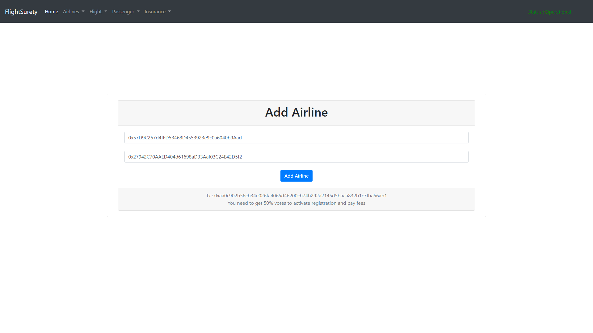

### Vote For Airline

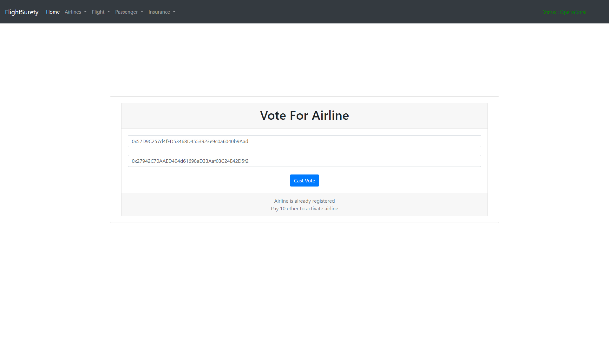

### Pay Registration Fee

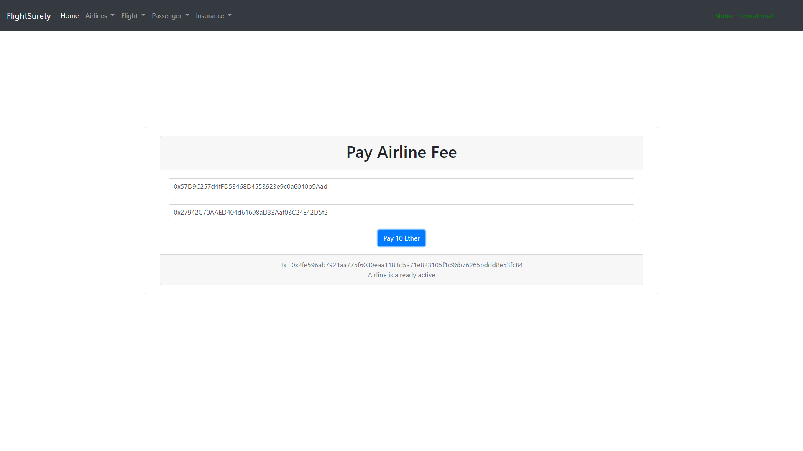

### Add Flight

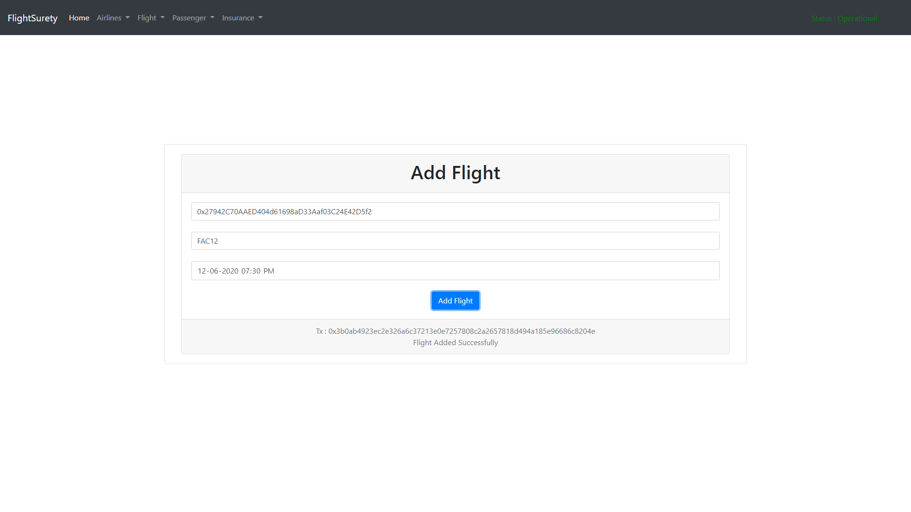

### Insurances List For A Flight

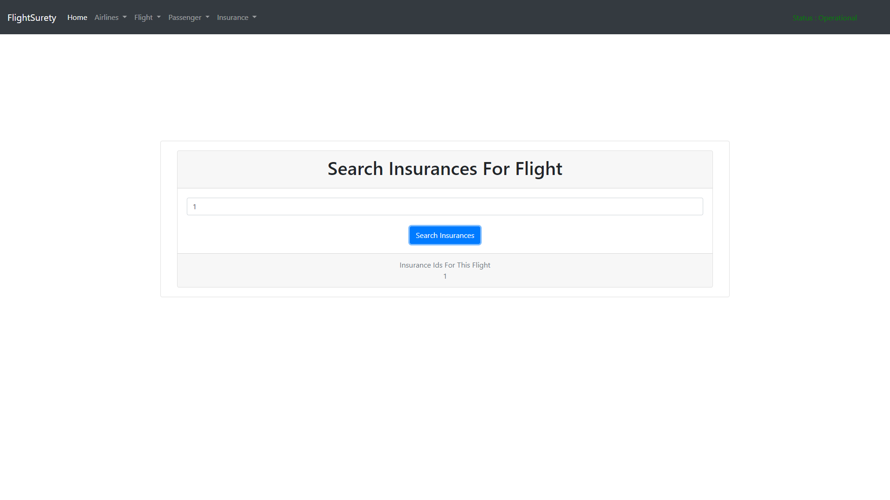

### Search Flight

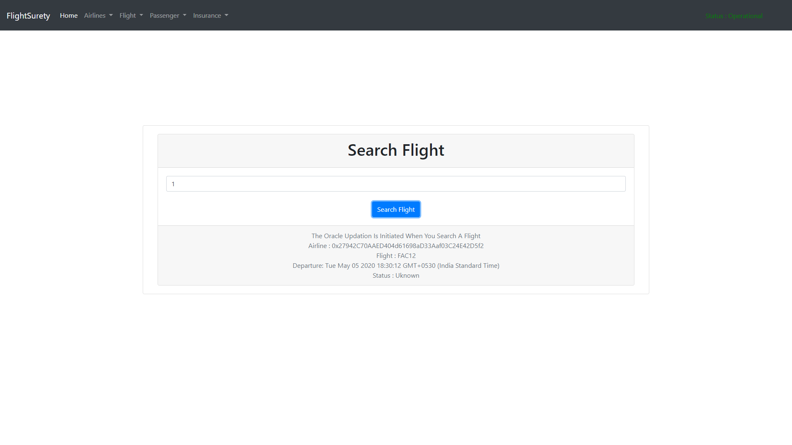

### Buy Insurance

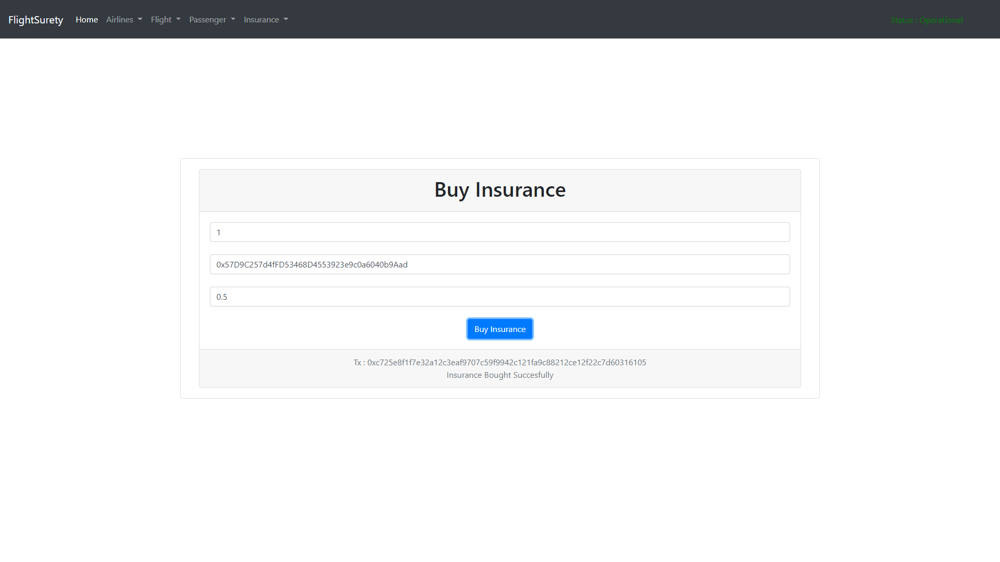

### Check Insurance

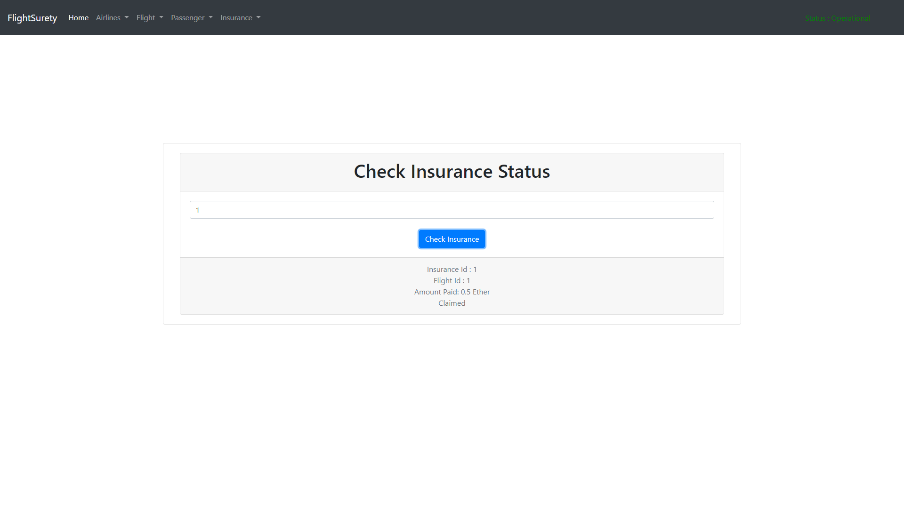

### Claim Insurance

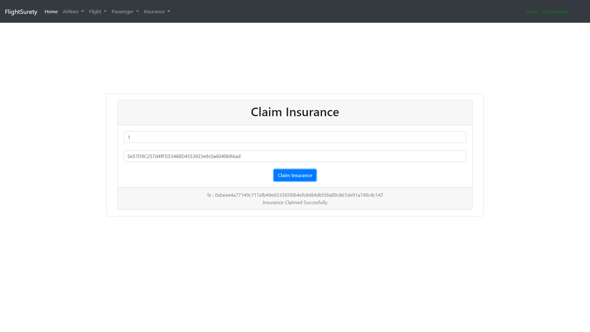

### Add Passenger

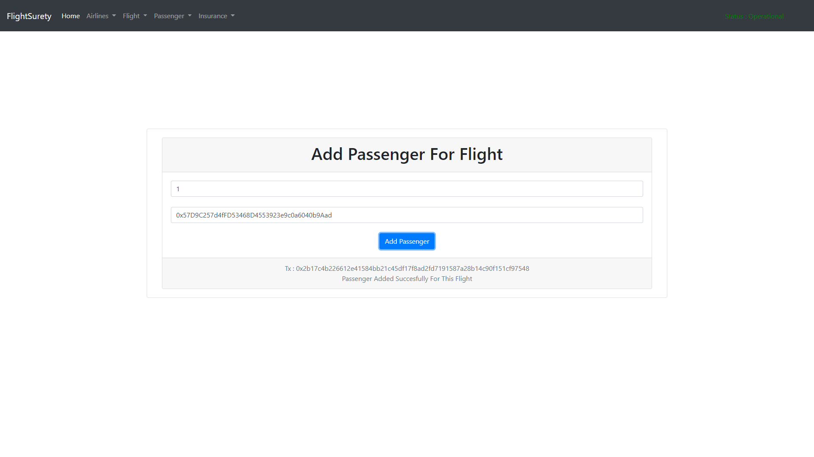

### List Of Insurances For A Passenger

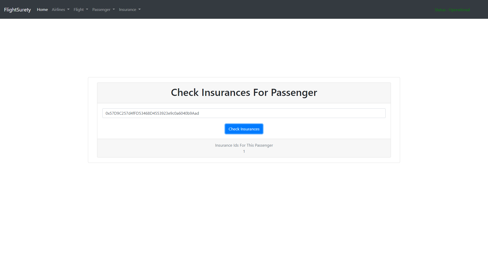

## Resources

* [How does Ethereum work anyway?](https://medium.com/@preethikasireddy/how-does-ethereum-work-anyway-22d1df506369)
* [BIP39 Mnemonic Generator](https://iancoleman.io/bip39/)
* [Truffle Framework](http://truffleframework.com/)
* [Ganache Local Blockchain](http://truffleframework.com/ganache/)
* [Remix Solidity IDE](https://remix.ethereum.org/)
* [Solidity Language Reference](http://solidity.readthedocs.io/en/v0.4.24/)
* [Ethereum Blockchain Explorer](https://etherscan.io/)
* [Web3Js Reference](https://github.com/ethereum/wiki/wiki/JavaScript-API)