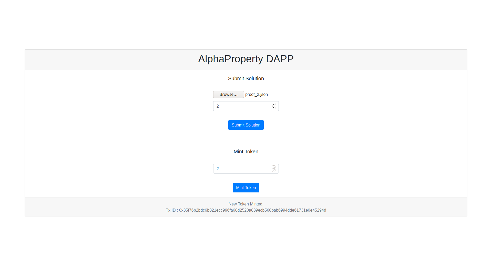
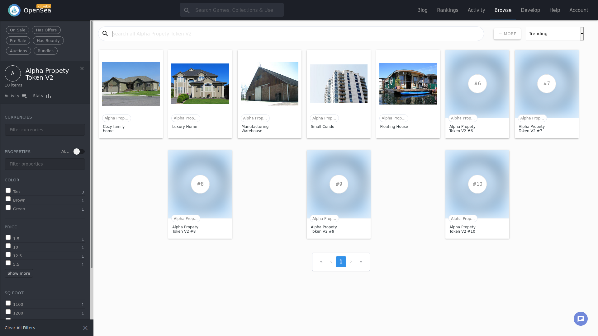

# Udacity Blockchain Capstone

The capstone will build upon the knowledge you have gained in the course in order to build a decentralized housing product. 

## Prerequisites

Please make sure you've already installed metamask, ganache-cli, Truffle, NodeJS, NPM an Docker.

## Install

This repository contains Smart Contract code in Solidity (using Truffle), tests (also using Truffle), dApp scaffolding (using HTML, CSS and JS) and server app scaffolding.

Clone this repository:

```
git clone https://github.com/AlphaArtrem/udacity_blockchain_developer_nanodegree.git
```

Change directory to ```p5_real_estate_marketplace``` folder :

```
cd p5_real_estate_marketplace
npm install
```

Launch Ganache:

```
ganache-cli 
```

In a separate terminal window, Compile smart contracts:
This will create the smart contract artifacts in folder ```build\contracts``` and install all requisite npm packages (as listed in ```package.json```).

```
cd eth-contracts
npm install
truffle compile
```


## Testing

To run truffle tests:

```
truffle test
```

## Dapp

To use the dapp:

```
truffle migrate --reset --network development
cd ../
cd ./dapp/
npm install
npm run dapp
```

To view dapp visit in browser:

```
http://localhost:8080
```


## Generating proofs

```
sudo systemctl start docker
docker run -v `pwd`/zokrates/code/:/home/zokrates/code -ti zokrates/zokrates /bin/bash
cd code/square/
~/zokrates compile -i square.code
~/zokrates setup
~/zokrates compute-witness -a 4 16
~/zokrates generate-proof
~/zokrates export-verifier
```

Run ```~/zokrates compute-witness -a 4 16``` and ```~/zokrates generate-proof``` again with different numbers to create more proofs.

## Minting Tokens

* Open Dapp in browser: ```http://localhost:8080```

* Select ```proof.json``` file generated using zokrates in the submit solution section.
* Enter a token ID.
* Click Submit.
* After submitting solution use the ID to mint token by entering ID in min token section.
* Click mint token.

## Versions

```
* Solidity          - v0.5.16
* Ganache-cli       - v6.9.1
* Truffle           - v5.1.22
* NodeJS            - v12.16.2
```

## Contract Addresses

Contract addresses on the rinkeby network.

* SolnVerifier          -   ```0xE91562c0734FDCF3A26B6177DF438596F64D84F6``` 
* Verfier               -   ```0xB89155ef747Cc52248B0cFf0A8796820723e4043```
* AlphaPropertyToken    -   ```0xB441824624989D39c900930a6ba1ef90c144ba23```

## Dapp Screenshot

The DApp User Interface when running should look like...



## OpenSeas

[Visit MarketPlace On OpenSeas](https://rinkeby.opensea.io/assets/alpha-propety-token-v2), The OpenSeas marketplace should look like this...




## Project Resources

* [Remix - Solidity IDE](https://remix.ethereum.org/)
* [Visual Studio Code](https://code.visualstudio.com/)
* [Truffle Framework](https://truffleframework.com/)
* [Ganache - One Click Blockchain](https://truffleframework.com/ganache)
* [Open Zeppelin ](https://openzeppelin.org/)
* [Interactive zero knowledge 3-colorability demonstration](http://web.mit.edu/~ezyang/Public/graph/svg.html)
* [Docker](https://docs.docker.com/install/)
* [ZoKrates](https://github.com/Zokrates/ZoKrates)
